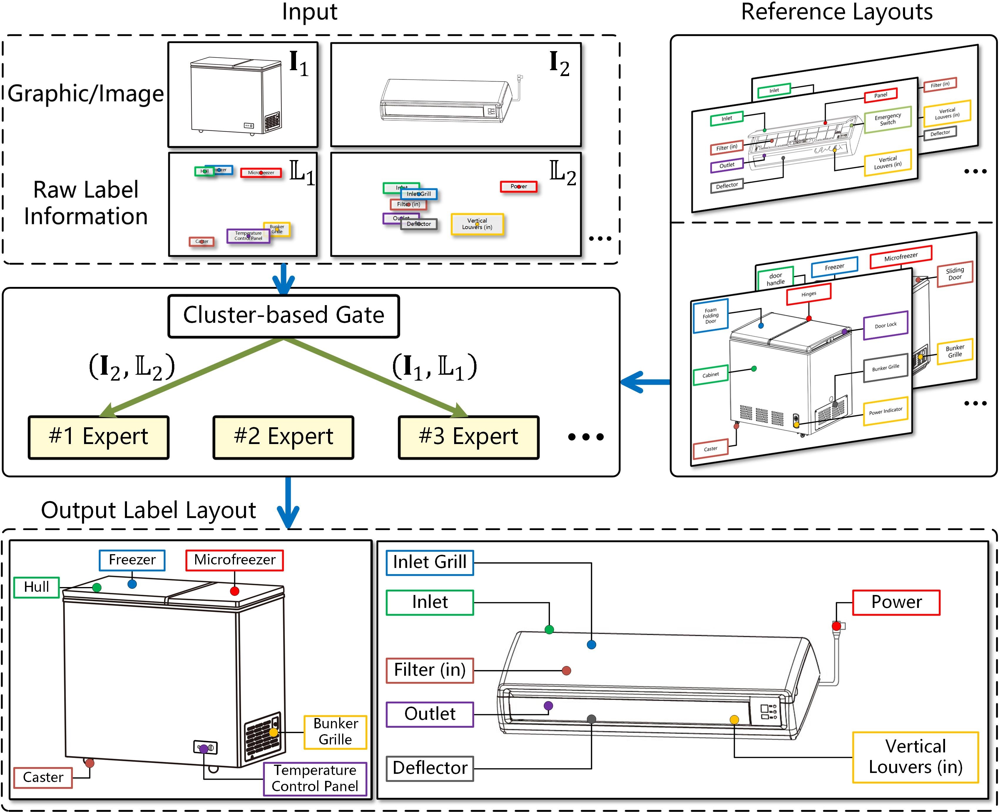

# Mixture of Cluster-guided Experts for Retrieval-Augmented Label Placement

</div>

This repository is the implementation of the paper:

Pingshun Zhang, Enyu Che, Yinan Chen, Bingyao Huang, Haibin Ling and Jingwei Qu. [Mixture of Cluster-guided Experts for Retrieval-Augmented Label Placement](https://jingweiqu.github.io/project/LPCE/index.html). *TVCG*, 2026.

It contains the training and evaluation procedures in the paper.

## Requirements
* **[Python](https://www.python.org/)** (>= 3.10.12)
* **[PyTorch](https://pytorch.org/)** (>= 2.0.1)
* **[PyG](https://www.pyg.org/)** (>= 2.3.1)

## Dataset
Download the [SWU-AMIL](https://higa.teracloud.jp/share/11e166714db7d0e6) dataset and extract it to the folder `data`.

## Dreamsim
We adopt DreamSim to measure image similarity between the query and candidate samples. The project is open-source. You can download the [code](https://github.com/ssundaram21/dreamsim).

## Evaluation
Reference feature extractor evaluation:
```bash
python test_style.py experiments/SWU_style.json
```
Run evaluation:

We have provided trained model parameters ( [trained_models.pt](https://higa.teracloud.jp/share/11e18831e486e091) ).
```bash
python test.py experiments/SWU.json
```

## Training
Reference feature extractor training:
```bash
python train_style.py experiments/SWU_style.json
```
Run training:
```bash
python train.py experiments/SWU.json
```

## Note
From `one_style_feature` to `three_style_features`, just stack them based on Dreamsim results.

## Citation
```text
@article{zhang2026mixture,
        title={Mixture of Cluster-guided Experts for Retrieval-Augmented Label Placement},
        author={Zhang, Pingshun and Che, Enyu and Chen, Yinan and Huang, Bingyao and Ling, Haibin and Qu, Jingwei},
        journal={IEEE Transactions on Visualization and Computer Graphics},
        year={2026}
        doi={10.1109/TVCG.2025.3642518}
}
```
